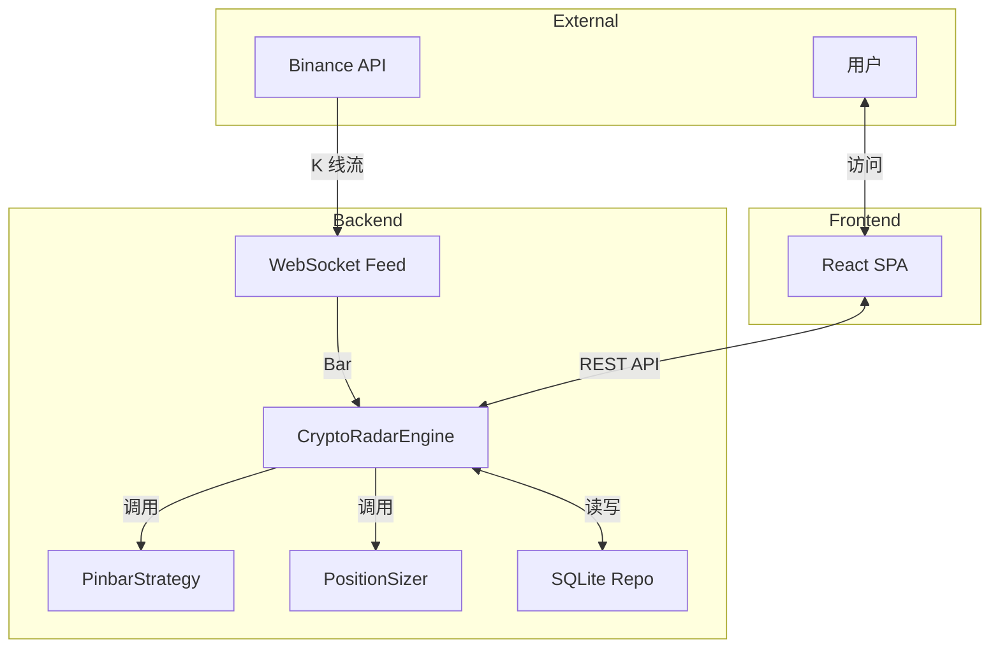

# 代码改进建议文档

## 概述

本文档基于对项目代码的深入分析，为每个核心模块提出不少于 5 点的改进建议，旨在提升代码质量、可维护性、性能和安全性。

---

## 1. core/ 核心层改进建议

### 1.1 entities.py

**建议 1：引入 Pydantic 进行数据验证**
```python
# 当前：使用 dataclass，无运行时验证
@dataclass
class RiskConfig:
    risk_pct: float
    max_sl_dist: float
    max_leverage: float
    max_positions: int = 4

# 建议：使用 Pydantic，自动验证边界
from pydantic import BaseModel, Field, field_validator

class RiskConfig(BaseModel):
    risk_pct: float = Field(gt=0, le=0.1, description="单笔风险比例")
    max_sl_dist: float = Field(gt=0, lt=1.0, description="最大止损距离")
    max_leverage: float = Field(ge=1, le=125, description="最大杠杆")
    max_positions: int = Field(ge=1, description="最大持仓数")

    @field_validator('risk_pct')
    @classmethod
    def validate_risk_pct(cls, v):
        if v <= 0 or v > 0.1:
            raise ValueError('risk_pct 必须在 (0, 0.1] 范围内')
        return v
```

**建议 2：为 Signal 添加唯一标识生成**
```python
# 当前：Signal 没有唯一标识，依赖数据库自增 ID
@dataclass
class Signal:
    id: Optional[int] = None  # 仅在查询时有值

# 建议：添加 UUID，便于跨系统追踪
import uuid
from dataclasses import field, replace

@dataclass
class Signal:
    id: Optional[int] = None
    uuid: str = field(default_factory=lambda: str(uuid.uuid4()))  # 新增
    symbol: str
    # ... 其他字段

    def with_id(self, id: int) -> 'Signal':
        """返回带有数据库 ID 的新实例"""
        return replace(self, id=id)
```

**建议 3：添加类型注解的严格性**
```python
# 当前：部分字段使用 Optional 但未明确是否可为空
@dataclass
class Signal:
    score_details: Dict[str, float] = field(default_factory=dict)

# 建议：明确区分必填和可选字段
from typing import Required, NotRequired, TypedDict

class ScoreDetails(TypedDict):
    shape: Required[float]
    trend: Required[float]
    vol: Required[float]
    quality_tier: NotRequired[str]
    risk_penalty: NotRequired[float]
```

**建议 4：添加__post_init__验证**
```python
@dataclass
class ScoringWeights:
    w_shape: float
    w_trend: float
    w_vol: float

    def __post_init__(self):
        total = self.w_shape + self.w_trend + self.w_vol
        if abs(total - 1.0) > 0.0001:
            raise ValueError(f"权重总和必须为 1.0，当前为：{total}")
```

**建议 5：添加序列化/反序列化方法**
```python
@dataclass
class Signal:
    # ... 字段定义

    def to_dict(self) -> dict:
        """转换为字典，便于 JSON 序列化"""
        return dataclasses.asdict(self)

    @classmethod
    def from_dict(cls, data: dict) -> 'Signal':
        """从字典创建实例"""
        return cls(**data)
```

---

### 1.2 interfaces.py

**建议 1：添加接口文档字符串**
```python
class IDataFeed(ABC):
    """
    实时行情源订阅接口

    职责:
    - 订阅多币种、多级别的 K 线数据流
    - 将原始数据转换为统一的 Bar 实体
    - 处理网络断线重连

    实现注意事项:
    - 必须是异步迭代器
    - 必须处理异常并自动重连
    - 只 yield 已闭合的 K 线 (is_closed=True)
    """
```

**建议 2：添加超时和重试策略接口**
```python
class IDataFeed(ABC):
    @abstractmethod
    async def subscribe_klines(
        self,
        symbols: List[str],
        intervals: List[str],
        timeout: float = 30.0,  # 新增：超时时间
        reconnect_attempts: int = 5  # 新增：重试次数
    ) -> AsyncIterator[Bar]:
        pass
```

**建议 3：添加健康检查接口**
```python
class IAccountReader(ABC):
    @abstractmethod
    async def fetch_account_balance(self) -> AccountBalance:
        pass

    @abstractmethod
    async def health_check(self) -> bool:  # 新增
        """检查 API 连接状态"""
        pass
```

**建议 4：添加批量操作接口**
```python
class IRepository(ABC):
    @abstractmethod
    async def save_signal(self, signal: Signal) -> None:
        pass

    @abstractmethod
    async def save_signals_batch(self, signals: List[Signal]) -> int:  # 新增
        """批量保存信号，返回成功数量"""
        pass
```

**建议 5：添加上下文管理器支持**
```python
class IRepository(ABC):
    @abstractmethod
    async def __aenter__(self) -> 'IRepository':
        pass

    @abstractmethod
    async def __aexit__(self, exc_type, exc_val, exc_tb) -> None:
        pass
```

---

### 1.3 exceptions.py

**建议 1：建立完整的异常层次结构**
```python
class MonitorException(Exception):
    """所有自定义异常的基类"""
    pass

class RiskLimitExceeded(MonitorException):
    """风控超限异常"""
    pass

class DataValidationError(MonitorException):
    """数据验证异常"""
    pass

class ExternalAPIError(MonitorException):
    """外部 API 调用异常"""
    pass

class NotificationError(MonitorException):
    """通知推送异常"""
    pass
```

**建议 2：添加异常日志记录**
```python
import logging

logger = logging.getLogger(__name__)

class RiskLimitExceeded(Exception):
    def __init__(self, message: str, error_code: str = "RISK_LIMIT_EXCEEDED", context: dict = None):
        super().__init__(message)
        self.message = message
        self.error_code = error_code
        self.context = context or {}
        logger.warning(f"风控异常：{error_code} - {message}, 上下文：{context}")
```

**建议 3：添加异常转换方法**
```python
class RiskLimitExceeded(Exception):
    def to_dict(self) -> dict:
        """转换为字典，便于 API 返回"""
        return {
            "error_code": self.error_code,
            "message": self.message,
            "context": self.context
        }
```

**建议 4：添加多语言支持**
```python
from typing import Dict

ERROR_MESSAGES: Dict[str, Dict[str, str]] = {
    "RISK_LIMIT_EXCEEDED": {
        "zh": "风控限制已超出",
        "en": "Risk limit exceeded"
    },
    "POSITION_LIMIT_EXCEEDED": {
        "zh": "持仓数量上限已超出",
        "en": "Position limit exceeded"
    }
}

class RiskLimitExceeded(Exception):
    def get_message(self, lang: str = "zh") -> str:
        return ERROR_MESSAGES.get(self.error_code, {}).get(lang, self.message)
```

**建议 5：添加异常统计**
```python
from collections import Counter

_exception_counter = Counter()

class RiskLimitExceeded(Exception):
    def __init__(self, message: str, error_code: str = "RISK_LIMIT_EXCEEDED", context: dict = None):
        super().__init__(message)
        self.error_code = error_code
        _exception_counter[error_code] += 1

    @classmethod
    def get_statistics(cls) -> dict:
        return dict(_exception_counter)
```

---

## 2. domain/ 领域层改进建议

### 2.1 strategy/pinbar.py

**建议 1：提取形态度量为独立值对象**
```python
@dataclass
class PinbarMetrics:
    """Pinbar 形态度量值对象"""
    body_ratio: float
    shadow_ratio: float
    is_doji: bool
    direction: Optional[str]
    quality_score: float

# 在 PinbarStrategy 中使用
def _evaluate_shape(self, current_bar: Bar, config: PinbarConfig) -> PinbarMetrics:
    # ...
    return PinbarMetrics(
        body_ratio=body_ratio,
        shadow_ratio=shadow_ratio,
        is_doji=is_doji,
        direction=direction,
        quality_score=quality_score
    )
```

**建议 2：使用策略模式重构评分逻辑**
```python
# 当前：评分逻辑硬编码在 evaluate 方法中
# 建议：使用独立的评分策略类
class IPinbarScorer(ABC):
    @abstractmethod
    def score(self, metrics: PinbarMetrics, config: PinbarConfig) -> float:
        pass

class DefaultPinbarScorer(IPinbarScorer):
    def score(self, metrics: PinbarMetrics, config: PinbarConfig) -> float:
        # 默认评分逻辑
        pass

class StrictPinbarScorer(IPinbarScorer):
    def score(self, metrics: PinbarMetrics, config: PinbarConfig) -> float:
        # 更严格的评分逻辑
        pass

# 在 PinbarStrategy 中使用
class PinbarStrategy:
    def __init__(self, scorer: IPinbarScorer = None):
        self.scorer = scorer or DefaultPinbarScorer()
```

**建议 3：添加形态识别的单元测试辅助方法**
```python
class PinbarStrategy:
    # 新增：用于测试的辅助方法
    def create_test_bar(
        self,
        symbol: str = "ETHUSDT",
        open: float = 3500,
        high: float = 3550,
        low: float = 3450,
        close: float = 3540,
        is_closed: bool = True
    ) -> Bar:
        """创建测试用 Bar，便于单元测试"""
        return Bar(
            symbol=symbol, interval="1h",
            timestamp=int(time.time() * 1000),
            open=open, high=high, low=low, close=close,
            volume=0, is_closed=is_closed
        )
```

**建议 4：添加形态识别的可解释性输出**
```python
@dataclass
class ShapeAnalysis:
    """形态分析结果"""
    metrics: PinbarMetrics
    explanation: str  # 人类可读的解释
    confidence: float  # 置信度 0-1

def _analyze_shape(self, current_bar: Bar, config: PinbarConfig) -> ShapeAnalysis:
    metrics = self._evaluate_shape(current_bar, config)

    explanation = []
    if metrics.is_doji:
        explanation.append("这是一个十字星形态")
    if metrics.body_ratio < 0.2:
        explanation.append(f"实体很小 ({metrics.body_ratio:.1%})，形态标准")
    if metrics.shadow_ratio > 3:
        explanation.append(f"影线很长 ({metrics.shadow_ratio:.1f}倍)，信号强烈")

    return ShapeAnalysis(
        metrics=metrics,
        explanation="; ".join(explanation),
        confidence=self._calculate_confidence(metrics)
    )
```

**建议 5：添加缓存机制避免重复计算**
```python
from functools import lru_cache

class PinbarStrategy:
    @lru_cache(maxsize=128)
    def _calculate_ema_cached(self, closes_tuple: tuple, period: int) -> float:
        """缓存 EMA 计算结果"""
        closes = list(closes_tuple)
        return calculate_ema(closes, period)

    def evaluate(self, ...) -> Optional[Signal]:
        # 使用缓存
        closes_tuple = tuple(b.close for b in all_bars)
        ema60 = self._calculate_ema_cached(closes_tuple, self.ema_period)
```

---

### 2.2 strategy/scoring.py

**建议 1：使用配置驱动评分参数**
```python
# 当前：评分阈值硬编码
# 建议：从配置文件加载
class ScoringConfig:
    shadow_min: float = 0.6
    shadow_max: float = 0.9
    body_good: float = 0.1
    body_bad: float = 0.5

def calculate_score(bar: Bar, config: ScoringConfig) -> int:
    # 使用配置参数
    s_shadow = (shadow_ratio - config.shadow_min) / (config.shadow_max - config.shadow_min) * 100
```

**建议 2：添加评分分布统计**
```python
from collections import deque

class ScoringService:
    def __init__(self, history_size: int = 1000):
        self._score_history = deque(maxlen=history_size)

    def calculate_score(self, ...) -> int:
        score = ...  # 计算得分
        self._score_history.append(score)
        return score

    def get_score_statistics(self) -> dict:
        """获取评分分布统计"""
        if not self._score_history:
            return {}
        scores = list(self._score_history)
        return {
            "mean": sum(scores) / len(scores),
            "min": min(scores),
            "max": max(scores),
            "p50": sorted(scores)[len(scores)//2],
            "p90": sorted(scores)[int(len(scores)*0.9)]
        }
```

**建议 3：添加评分权重热重载**
```python
import asyncio

class ScoringService:
    def __init__(self, repo: IRepository):
        self.repo = repo
        self._weights = ScoringWeights(w_shape=0.4, w_trend=0.4, w_vol=0.2)
        self._reload_task = None

    async def start_auto_reload(self):
        """定期从数据库重载权重配置"""
        async def reload_loop():
            while True:
                await asyncio.sleep(60)  # 每分钟重载一次
                weights_json = await self.repo.get_secret("scoring_weights")
                if weights_json:
                    self._weights = ScoringWeights(**json.loads(weights_json))

        self._reload_task = asyncio.create_task(reload_loop())
```

**建议 4：添加评分历史记录**
```python
@dataclass
class ScoreRecord:
    timestamp: int
    symbol: str
    score: int
    details: dict

class ScoringService:
    def __init__(self):
        self._history: List[ScoreRecord] = []

    def record_score(self, symbol: str, score: int, details: dict):
        self._history.append(ScoreRecord(
            timestamp=int(time.time() * 1000),
            symbol=symbol,
            score=score,
            details=details
        ))
```

**建议 5：添加 A/B 测试支持**
```python
class ScoringService:
    def __init__(self, test_group: str = "control"):
        self.test_group = test_group  # "control" or "experiment"

    def calculate_score(self, ...) -> int:
        if self.test_group == "control":
            return self._calculate_classic(...)
        else:
            return self._calculate_experimental(...)
```

---

### 2.3 risk/sizer.py

**建议 1：使用 Builder 模式构建 PositionSizing**
```python
class PositionSizingBuilder:
    def __init__(self, signal: Signal, account: AccountBalance, config: RiskConfig):
        self.signal = signal
        self.account = account
        self.config = config
        self.leverage_capped = False
        self.actual_risk_amount = 0.0

    def calculate_leverage(self) -> 'PositionSizingBuilder':
        # 计算杠杆
        return self

    def apply_cap(self) -> 'PositionSizingBuilder':
        # 应用杠杆熔断
        self.leverage_capped = True
        return self

    def build(self) -> PositionSizing:
        return PositionSizing(
            signal=self.signal,
            suggested_leverage=...,
            # ...
        )

# 使用
sizing = (PositionSizingBuilder(signal, account, config)
          .calculate_leverage()
          .apply_cap()
          .build())
```

**建议 2：添加计算过程的日志追踪**
```python
import logging

logger = logging.getLogger(__name__)

class PositionSizer:
    def calculate(self, ...) -> PositionSizing:
        logger.debug(f"开始算仓：symbol={signal.symbol}, entry={signal.entry_price}")

        # ... 计算过程

        logger.info(
            f"算仓完成：leverage={sizing.suggested_leverage:.2f}x, "
            f"quantity={sizing.suggested_quantity:.4f}, "
            f"risk=${sizing.risk_amount:.2f}"
        )

        return sizing
```

**建议 3：添加算仓模拟器**
```python
@dataclass
class WhatIfResult:
    original: PositionSizing
    modified: PositionSizing
    difference: dict

class PositionSizer:
    def what_if(self, signal: Signal, account: AccountBalance,
                config_changes: dict) -> WhatIfResult:
        """模拟不同配置下的算仓结果"""
        original_config = dataclasses.replace(self.config)
        modified_config = dataclasses.replace(self.config, **config_changes)

        original = self.calculate(signal, account, original_config)
        modified = self.calculate(signal, account, modified_config)

        return WhatIfResult(
            original=original,
            modified=modified,
            difference={
                "leverage_diff": modified.suggested_leverage - original.suggested_leverage,
                "quantity_diff": modified.suggested_quantity - original.suggested_quantity,
                "risk_diff": modified.risk_amount - original.risk_amount
            }
        )
```

**建议 4：添加风险预警**
```python
@dataclass
class RiskWarning:
    level: str  # "info", "warning", "critical"
    message: str
    suggestion: str

class PositionSizer:
    def calculate_with_warnings(self, ...) -> Tuple[PositionSizing, List[RiskWarning]]:
        sizing = self.calculate(signal, account, config)
        warnings = []

        if sizing.leverage_capped:
            warnings.append(RiskWarning(
                level="warning",
                message="触发杠杆熔断",
                suggestion="考虑降低风险比例或选择止损距离更大的信号"
            ))

        if sizing.actual_risk_amount < sizing.risk_amount * 0.8:
            warnings.append(RiskWarning(
                level="info",
                message="实际风险低于计划风险",
                suggestion="当前信号风险较低，可考虑适当增加仓位"
            ))

        return sizing, warnings
```

**建议 5：添加算仓结果验证**
```python
class PositionSizer:
    def _validate_result(self, sizing: PositionSizing) -> None:
        """验证算仓结果的合理性"""
        if sizing.suggested_leverage <= 0:
            raise ValueError("杠杆倍数必须为正数")
        if sizing.suggested_quantity <= 0:
            raise ValueError("开仓数量必须为正数")
        if sizing.suggested_leverage > 125:
            raise ValueError("杠杆倍数超过交易所限制")

        # 验证风险金额与仓位价值的一致性
        expected_notional = sizing.suggested_quantity * sizing.signal.entry_price
        actual_notional = sizing.investment_amount * sizing.suggested_leverage
        if abs(expected_notional - actual_notional) / expected_notional > 0.01:
            logger.warning(f"算仓结果不一致：期望={expected_notional}, 实际={actual_notional}")
```

---

### 2.4 risk/portfolio_risk.py

**建议 1：添加风险趋势分析**
```python
@dataclass
class PortfolioRiskTrend:
    current_risk: float
    avg_risk_24h: float
    trend: str  # "increasing", "decreasing", "stable"

class PortfolioRiskService:
    def __init__(self):
        self._risk_history: List[Tuple[int, float]] = []  # [(timestamp, risk_pct)]

    def record_risk(self, risk_pct: float):
        self._risk_history.append((int(time.time() * 1000), risk_pct))

    def get_trend(self) -> PortfolioRiskTrend:
        if len(self._risk_history) < 2:
            return PortfolioRiskTrend(0, 0, "stable")

        current = self._risk_history[-1][1]
        avg_24h = sum(r[1] for r in self._risk_history[-24:]) / min(len(self._risk_history), 24)

        if current > avg_24h * 1.1:
            trend = "increasing"
        elif current < avg_24h * 0.9:
            trend = "decreasing"
        else:
            trend = "stable"

        return PortfolioRiskTrend(current, avg_24h, trend)
```

**建议 2：添加风险分解**
```python
@dataclass
class RiskBreakdown:
    by_symbol: Dict[str, float]  # {symbol: risk_amount}
    by_direction: Dict[str, float]  # {"LONG": x, "SHORT": y}
    concentration: float  # 最大单一风险占比

class PortfolioRiskService:
    def get_risk_breakdown(self, positions: List[Position]) -> RiskBreakdown:
        by_symbol = {}
        by_direction = {"LONG": 0, "SHORT": 0}
        max_risk = 0

        for pos in positions:
            risk = getattr(pos, 'risk_amount', 0)
            by_symbol[pos.symbol] = by_symbol.get(pos.symbol, 0) + risk
            by_direction[pos.direction] += risk
            max_risk = max(max_risk, risk)

        total_risk = sum(by_symbol.values())
        concentration = max_risk / total_risk if total_risk > 0 else 0

        return RiskBreakdown(
            by_symbol=by_symbol,
            by_direction=by_direction,
            concentration=concentration
        )
```

**建议 3：添加情景分析**
```python
@dataclass
class ScenarioResult:
    scenario: str
    impact_pnl: float
    impact_risk: float

class PortfolioRiskService:
    def analyze_scenarios(self, positions: List[Position]) -> List[ScenarioResult]:
        """分析极端行情下的风险情景"""
        results = []

        # 情景 1：所有持仓同时下跌 5%
        impact_5pct = sum(pos.position_value for pos in positions) * 0.05
        results.append(ScenarioResult(
            scenario="所有持仓下跌 5%",
            impact_pnl=-impact_5pct,
            impact_risk=0  # 假设风险不变
        ))

        # 情景 2：所有持仓同时下跌 10%
        impact_10pct = sum(pos.position_value for pos in positions) * 0.10
        results.append(ScenarioResult(
            scenario="所有持仓下跌 10%",
            impact_pnl=-impact_10pct,
            impact_risk=0
        ))

        return results
```

**建议 4：添加风险预算计算**
```python
class PortfolioRiskService:
    def calculate_risk_budget(
        self,
        total_wallet_balance: float,
        max_portfolio_risk_pct: float,
        current_positions: List[Position]
    ) -> dict:
        """计算剩余风险预算"""
        current_risk = sum(getattr(p, 'risk_amount', 0) for p in current_positions)
        max_risk = total_wallet_balance * max_portfolio_risk_pct
        remaining_risk = max_risk - current_risk

        return {
            "max_risk": max_risk,
            "current_risk": current_risk,
            "remaining_risk": remaining_risk,
            "utilization_pct": current_risk / max_risk * 100 if max_risk > 0 else 0
        }
```

**建议 5：添加风险相关性分析**
```python
class PortfolioRiskService:
    def calculate_correlation_risk(
        self,
        positions: List[Position],
        price_correlations: Dict[str, Dict[str, float]]
    ) -> float:
        """
        计算持仓相关性风险

        :param positions: 持仓列表
        :param price_correlations: 币种间价格相关性矩阵
        :return: 相关性风险系数 (0-1, 越高表示相关性越强)
        """
        if len(positions) < 2:
            return 0.0

        total_correlation = 0
        count = 0

        for i, pos1 in enumerate(positions):
            for j, pos2 in enumerate(positions):
                if i >= j:
                    continue
                corr = price_correlations.get(pos1.symbol, {}).get(pos2.symbol, 0.5)
                total_correlation += abs(corr)
                count += 1

        return total_correlation / count if count > 0 else 0.0
```

---

## 3. application/ 应用层改进建议

### 3.1 monitor_engine.py

**建议 1：添加启动健康检查**
```python
class CryptoRadarEngine:
    async def health_check(self) -> dict:
        """启动前健康检查"""
        checks = {}

        # 检查 WebSocket 连接
        checks["websocket"] = await self._check_websocket()

        # 检查账户 API
        checks["account_api"] = await self._check_account_api()

        # 检查数据库
        checks["database"] = await self._check_database()

        all_passed = all(v.get("status") == "ok" for v in checks.values())

        return {
            "status": "healthy" if all_passed else "unhealthy",
            "checks": checks,
            "timestamp": int(time.time() * 1000)
        }
```

**建议 2：添加优雅降级机制**
```python
class CryptoRadarEngine:
    async def start(self):
        degraded_mode = False

        while True:
            try:
                # 尝试正常流程
                async for current_bar in self.feed.subscribe_klines(...):
                    try:
                        await self._process_bar(current_bar)
                    except Exception as e:
                        # 降级：仅记录不推送
                        if not degraded_mode:
                            logger.warning(f"进入降级模式：{e}")
                            degraded_mode = True
                        await self.repo.save_signal(signal)  # 仅入库

            except Exception as e:
                # 完全降级：等待重试
                logger.error(f"引擎异常，10 秒后重试：{e}")
                await asyncio.sleep(10)
```

**建议 3：添加性能监控**
```python
import time
from collections import deque

class CryptoRadarEngine:
    def __init__(self, ...):
        self._processing_times = deque(maxlen=1000)
        self._bars_processed = 0

    async def _process_bar(self, bar: Bar):
        start = time.time()
        try:
            # ... 处理逻辑
            self._bars_processed += 1
        finally:
            elapsed = time.time() - start
            self._processing_times.append(elapsed)

    def get_performance_stats(self) -> dict:
        if not self._processing_times:
            return {}

        times = list(self._processing_times)
        return {
            "bars_processed": self._bars_processed,
            "avg_processing_time_ms": sum(times) / len(times) * 1000,
            "p99_processing_time_ms": sorted(times)[int(len(times) * 0.99)] * 1000
        }
```

**建议 4：添加事件钩子**
```python
from typing import Callable, List

class CryptoRadarEngine:
    def __init__(self, ...):
        self._on_signal_hooks: List[Callable] = []
        self._on_error_hooks: List[Callable] = []

    def register_signal_hook(self, hook: Callable):
        """注册信号处理钩子"""
        self._on_signal_hooks.append(hook)

    def register_error_hook(self, hook: Callable):
        """注册错误处理钩子"""
        self._on_error_hooks.append(hook)

    async def _process_bar(self, bar: Bar):
        # ... 处理逻辑

        if signal:
            # 触发钩子
            for hook in self._on_signal_hooks:
                try:
                    await hook(signal)
                except Exception as e:
                    logger.error(f"信号钩子异常：{e}")
```

**建议 5：添加运行模式切换**
```python
from enum import Enum

class EngineMode(str, Enum):
    FULL = "full"           # 完整模式：检测 + 算仓 + 入库 + 推送
    DETECTION_ONLY = "detection"  # 仅检测：检测 + 入库
    BACKTEST = "backtest"   # 回测模式：检测 + 记录，不推送

class CryptoRadarEngine:
    def __init__(self, ..., mode: EngineMode = EngineMode.FULL):
        self.mode = mode

    async def _process_bar(self, bar: Bar):
        if signal:
            if self.mode == EngineMode.FULL:
                await self._full_process(signal)
            elif self.mode == EngineMode.DETECTION_ONLY:
                await self.repo.save_signal(signal)
            elif self.mode == EngineMode.BACKTEST:
                self._backtest_results.append(signal)
```

---

### 3.2 history_scanner.py

**建议 1：添加扫描进度持久化**
```python
@dataclass
class ScanProgress:
    task_id: str
    symbol: str
    interval: str
    scanned_bars: int
    total_bars: int
    last_timestamp: int
    status: str

class HistoryScanner:
    async def _save_progress(self, progress: ScanProgress):
        """保存扫描进度到数据库"""
        await self.repo.set_secret(
            f"scan_progress:{progress.task_id}",
            json.dumps(dataclasses.asdict(progress))
        )

    async def _load_progress(self, task_id: str) -> Optional[ScanProgress]:
        """加载断点续扫进度"""
        progress_json = await self.repo.get_secret(f"scan_progress:{task_id}")
        if progress_json:
            return ScanProgress(**json.loads(progress_json))
        return None
```

**建议 2：添加并发扫描支持**
```python
class HistoryScanner:
    async def scan_multiple(
        self,
        scan_tasks: List[dict],  # [{symbol, interval, start_date, end_date}]
        max_concurrent: int = 3
    ) -> List[str]:
        """并发扫描多个任务"""
        semaphore = asyncio.Semaphore(max_concurrent)

        async def bounded_scan(task: dict) -> str:
            async with semaphore:
                return self.submit_task(**task)

        tasks = [bounded_scan(task) for task in scan_tasks]
        return await asyncio.gather(*tasks)
```

**建议 3：添加扫描结果缓存**
```python
from functools import lru_cache

class HistoryScanner:
    @lru_cache(maxsize=100)
    def _get_cached_result_key(self, symbol: str, interval: str,
                               start_date: str, end_date: str) -> str:
        """生成缓存键"""
        return f"{symbol}:{interval}:{start_date}:{end_date}"

    async def _run_scan(self, task_id: str, ...):
        # 检查是否有缓存结果
        cache_key = self._get_cached_result_key(symbol, interval, start_date, end_date)
        # ... 使用缓存
```

**建议 4：添加扫描统计报告**
```python
@dataclass
class ScanReport:
    task_id: str
    total_bars: int
    signals_found: int
    signals_saved: int
    processing_time_seconds: float
    avg_signals_per_100_bars: float
    score_distribution: dict

class HistoryScanner:
    async def _run_scan(self, task_id: str, ...):
        start_time = time.time()
        # ... 扫描逻辑

        # 生成报告
        elapsed = time.time() - start_time
        report = ScanReport(
            task_id=task_id,
            total_bars=total_bars,
            signals_found=len(signals_found),
            signals_saved=signals_saved,
            processing_time_seconds=elapsed,
            avg_signals_per_100_bars=len(signals_found) / total_bars * 100,
            score_distribution=self._calculate_score_distribution(signals_found)
        )

        logger.info(f"扫描报告：{report}")
```

**建议 5：添加扫描任务优先级队列**
```python
import heapq
from dataclasses import field

@dataclass(order=True)
class PrioritizedScanTask:
    priority: int  # 数字越小优先级越高
    task: dict = field(compare=False)

class HistoryScanner:
    def __init__(self, ...):
        self._task_queue = []
        self._current_task = None

    def submit_task_with_priority(
        self,
        symbol: str,
        interval: str,
        start_date: str,
        end_date: str,
        priority: int = 5  # 默认优先级 5
    ) -> str:
        task = {
            "symbol": symbol,
            "interval": interval,
            "start_date": start_date,
            "end_date": end_date
        }
        heapq.heappush(self._task_queue, PrioritizedScanTask(priority, task))
        return self.submit_task(**task)
```

---

## 4. infrastructure/ 基础设施层改进建议

### 4.1 feed/binance_ws.py

**建议 1：添加心跳检测和自动重连**
```python
class BinanceWSFeed:
    def __init__(self, ...):
        self._last_message_time = 0
        self._heartbeat_timeout = 30.0  # 30 秒无消息视为断开

    async def subscribe_klines(self, ...) -> AsyncIterator[Bar]:
        while True:
            try:
                async with websockets.connect(url, ping_interval=20) as ws:
                    self._last_message_time = time.time()

                    async for msg in ws:
                        self._last_message_time = time.time()
                        # ... 处理消息

                    # 检查心跳超时
                    if time.time() - self._last_message_time > self._heartbeat_timeout:
                        logger.warning("心跳超时，正在重连...")
                        await asyncio.sleep(5)

            except Exception as e:
                logger.error(f"WebSocket 异常：{e}")
                await asyncio.sleep(5)
```

**建议 2：添加消息速率限制**
```python
from collections import deque

class BinanceWSFeed:
    def __init__(self, ...):
        self._message_times = deque(maxlen=1000)
        self._rate_limit_warning_threshold = 100  # 每秒 100 条

    async def subscribe_klines(self, ...) -> AsyncIterator[Bar]:
        async for msg in ws:
            now = time.time()
            self._message_times.append(now)

            # 计算当前消息速率
            recent_messages = [t for t in self._message_times if now - t < 1.0]
            rate = len(recent_messages)

            if rate > self._rate_limit_warning_threshold:
                logger.warning(f"消息速率过高：{rate}/s")

            # ... 处理消息
```

**建议 3：添加订阅状态管理**
```python
class BinanceWSFeed:
    def __init__(self, ...):
        self._subscriptions = set()  # 当前订阅的流
        self._reconnect_requested = False

    async def subscribe_klines(self, symbols: List[str], intervals: List[str]):
        # 检测订阅是否变化
        new_streams = set()
        for sym in symbols:
            for ivl in intervals:
                new_streams.add(f"{sym.lower()}@kline_{ivl}")

        if new_streams != self._subscriptions:
            logger.info(f"订阅变更：{self._subscriptions} -> {new_streams}")
            self._subscriptions = new_streams
            self._reconnect_requested = True

        # ... 重连逻辑
```

**建议 4：添加数据质量检查**
```python
class BinanceWSFeed:
    def __init__(self, ...):
        self._last_bar_times = {}  # {symbol: {interval: timestamp}}
        self._gap_threshold = 3600000  # 1 小时（毫秒）

    def _check_data_quality(self, bar: Bar) -> bool:
        """检查数据连续性"""
        symbol = bar.symbol
        interval = bar.interval

        if symbol not in self._last_bar_times:
            self._last_bar_times[symbol] = {}

        last_time = self._last_bar_times[symbol].get(interval, 0)
        gap = bar.timestamp - last_time

        if gap > self._gap_threshold:
            logger.warning(f"数据缺口：{symbol} {interval} 缺失 {gap/1000:.0f}秒")
            return False

        self._last_bar_times[symbol][interval] = bar.timestamp
        return True
```

**建议 5：添加连接池**
```python
class BinanceWSFeed:
    def __init__(self, ws_url: str, pool_size: int = 3):
        self.ws_url = ws_url
        self.pool_size = pool_size
        self._connections = []
        self._current_index = 0

    async def _create_connection_pool(self):
        """创建连接池"""
        for i in range(self.pool_size):
            ws = await websockets.connect(self.ws_url)
            self._connections.append(ws)
            logger.info(f"连接池：创建连接 {i+1}/{self.pool_size}")

    async def _get_connection(self) -> websockets.WebSocketClientProtocol:
        """轮询获取连接"""
        conn = self._connections[self._current_index]
        self._current_index = (self._current_index + 1) % len(self._connections)
        return conn
```

---

### 4.2 reader/binance_api.py

**建议 1：添加请求重试中间件**
```python
from tenacity import retry, stop_after_attempt, wait_exponential

class BinanceAccountReader:
    @retry(
        stop=stop_after_attempt(3),
        wait=wait_exponential(multiplier=1, min=1, max=10)
    )
    async def fetch_account_balance(self) -> AccountBalance:
        # ... 请求逻辑
        pass
```

**建议 2：添加请求速率限制**
```python
import asyncio

class BinanceAccountReader:
    def __init__(self, ...):
        self._rate_limiter = asyncio.Semaphore(10)  # 最多 10 个并发请求
        self._request_times = deque(maxlen=100)

    async def _acquire_rate_limit(self):
        """获取速率限制许可"""
        await self._rate_limiter.acquire()

        # 记录请求时间
        now = time.time()
        self._request_times.append(now)

        # 检查速率
        recent = [t for t in self._request_times if now - t < 1.0]
        if len(recent) >= 10:  # 每秒最多 10 个请求
            await asyncio.sleep(1.0 - (now - recent[0]))

    async def fetch_account_balance(self) -> AccountBalance:
        await self._acquire_rate_limit()
        try:
            # ... 请求逻辑
            pass
        finally:
            self._rate_limiter.release()
```

**建议 3：添加响应缓存**
```python
from functools import lru_cache
import asyncio

class BinanceAccountReader:
    def __init__(self, ...):
        self._balance_cache = None
        self._cache_timestamp = 0
        self._cache_ttl = 5.0  # 5 秒缓存

    async def fetch_account_balance(self) -> AccountBalance:
        now = time.time()

        # 检查缓存是否有效
        if (self._balance_cache is not None and
            now - self._cache_timestamp < self._cache_ttl):
            return self._balance_cache

        # 刷新缓存
        balance = await self._fetch_balance_impl()
        self._balance_cache = balance
        self._cache_timestamp = now
        return balance
```

**建议 4：添加详细的错误分类**
```python
from enum import Enum

class BinanceErrorCode(Enum):
    TIMESTAMP_ERROR = -1021
    API_KEY_INVALID = -2014
    ORDER_NOT_FOUND = -2013
    INSUFFICIENT_BALANCE = -2010
    # ... 更多错误码

class BinanceAPIError(Exception):
    def __init__(self, code: int, message: str):
        self.code = code
        self.message = message
        self.error_type = self._classify_error(code)

    def _classify_error(self, code: int) -> str:
        if code == BinanceErrorCode.TIMESTAMP_ERROR.value:
            return "timestamp"
        elif code in [e.value for e in BinanceErrorCode]:
            return "binance"
        else:
            return "unknown"
```

**建议 5：添加请求日志**
```python
class BinanceAccountReader:
    async def _signed_get(self, endpoint: str, **kwargs):
        start = time.time()
        try:
            # ... 请求逻辑
            elapsed = time.time() - start
            logger.debug(f"API 请求：{endpoint} 耗时：{elapsed*1000:.1f}ms 状态：{response.status_code}")
        except Exception as e:
            elapsed = time.time() - start
            logger.error(f"API 请求失败：{endpoint} 耗时：{elapsed*1000:.1f}ms 错误：{e}")
            raise
```

---

### 4.3 repo/sqlite_repo.py

**建议 1：添加连接池**
```python
import aiomysql  # 或保持使用 aiosqlite 的连接池

class SQLiteRepo:
    def __init__(self, db_path: str, pool_size: int = 5):
        self.db_path = db_path
        self.pool_size = pool_size
        self._pool = None

    async def initialize(self):
        """初始化连接池"""
        self._pool = await aiosqlite.create_pool(
            database=self.db_path,
            minsize=1,
            maxsize=self.pool_size
        )

    async def close(self):
        """关闭连接池"""
        if self._pool:
            await self._pool.close()
```

**建议 2：添加事务管理**
```python
class SQLiteRepo:
    @asynccontextmanager
    async def transaction(self):
        """事务上下文管理器"""
        async with aiosqlite.connect(self.db_path) as db:
            try:
                await db.execute("BEGIN")
                yield db
                await db.execute("COMMIT")
            except Exception as e:
                await db.execute("ROLLBACK")
                raise

    async def save_signal_and_sizing(self, signal: Signal, sizing: PositionSizing):
        """原子保存信号和算仓结果"""
        async with self.transaction() as db:
            await db.execute("INSERT INTO signals ...")
            await db.execute("INSERT INTO position_sizings ...")
```

**建议 3：添加查询性能监控**
```python
class SQLiteRepo:
    def __init__(self, ...):
        self._query_times = deque(maxlen=1000)
        self._slow_query_threshold = 1.0  # 1 秒

    async def get_signals(self, ...):
        start = time.time()
        try:
            # ... 查询逻辑
            pass
        finally:
            elapsed = time.time() - start
            self._query_times.append(elapsed)

            if elapsed > self._slow_query_threshold:
                logger.warning(f"慢查询：{elapsed:.2f}s, filter={filter_params}")

    def get_query_stats(self) -> dict:
        if not self._query_times:
            return {}
        times = list(self._query_times)
        return {
            "avg_ms": sum(times) / len(times) * 1000,
            "p95_ms": sorted(times)[int(len(times) * 0.95)] * 1000,
            "slow_queries": len([t for t in times if t > self._slow_query_threshold])
        }
```

**建议 4：添加数据库迁移支持**
```python
class SQLiteRepo:
    async def migrate(self, target_version: int):
        """数据库迁移"""
        async with aiosqlite.connect(self.db_path) as db:
            # 获取当前版本
            cursor = await db.execute("SELECT version FROM schema_version")
            current_version = (await cursor.fetchone())[0]

            # 执行迁移脚本
            for version in range(current_version + 1, target_version + 1):
                migration_script = self._get_migration_script(version)
                await db.executescript(migration_script)
                await db.execute("UPDATE schema_version SET version = ?", (version,))

            await db.commit()
```

**建议 5：添加数据导出导入**
```python
import yaml

class SQLiteRepo:
    async def export_data(self, tables: List[str] = None) -> dict:
        """导出数据"""
        if tables is None:
            tables = ["signals", "position_sizings", "configs"]

        export_data = {}
        async with aiosqlite.connect(self.db_path) as db:
            db.row_factory = aiosqlite.Row
            for table in tables:
                cursor = await db.execute(f"SELECT * FROM {table}")
                rows = await cursor.fetchall()
                export_data[table] = [dict(row) for row in rows]

        return export_data

    async def import_data(self, data: dict, skip_existing: bool = True):
        """导入数据"""
        async with aiosqlite.connect(self.db_path) as db:
            for table, rows in data.items():
                for row in rows:
                    # ... 导入逻辑
                    pass
            await db.commit()
```

---

### 4.4 notify/broadcaster.py

**建议 1：添加失败重试机制**
```python
from tenacity import retry, stop_after_attempt, wait_exponential

class NotificationBroadcaster(INotifier):
    @retry(
        stop=stop_after_attempt(3),
        wait=wait_exponential(multiplier=1, min=1, max=5)
    )
    async def _send_with_retry(self, channel: INotifier, message: str):
        """带重试的发送"""
        await channel.send_markdown(message)

    async def send_markdown(self, formatted_message: str) -> None:
        tasks = [
            self._send_with_retry(channel, formatted_message)
            for channel in self._channels
        ]
        results = await asyncio.gather(*tasks, return_exceptions=True)
        # ... 处理结果
```

**建议 2：添加推送模板**
```python
from string import Template

class NotificationTemplate:
    SIGNAL_TEMPLATE = Template("""
    **$title**
    $symbol | $direction
    入场：$entry_price
    止损：$stop_loss
    目标：$take_profit
    """)

class NotificationBroadcaster:
    async def send_signal(self, signal: Signal, sizing: PositionSizing):
        message = NotificationTemplate.SIGNAL_TEMPLATE.substitute(
            title=f"{signal.reason} · {signal.score/10}分",
            symbol=signal.symbol,
            direction=signal.direction,
            entry_price=signal.entry_price,
            stop_loss=signal.stop_loss,
            take_profit=signal.take_profit_1
        )
        await self.send_markdown(message)
```

**建议 3：添加推送历史记录**
```python
@dataclass
class NotificationRecord:
    timestamp: int
    channel: str
    message: str
    status: str  # "success", "failed"
    error: Optional[str] = None

class NotificationBroadcaster:
    def __init__(self, ...):
        self._history: List[NotificationRecord] = []

    async def send_markdown(self, formatted_message: str) -> None:
        tasks = []
        for channel in self._channels:
            task = self._send_and_record(channel, formatted_message)
            tasks.append(task)

        await asyncio.gather(*tasks, return_exceptions=True)

    async def _send_and_record(self, channel: INotifier, message: str):
        try:
            await channel.send_markdown(message)
            self._history.append(NotificationRecord(
                timestamp=int(time.time() * 1000),
                channel=channel.__class__.__name__,
                message=message,
                status="success"
            ))
        except Exception as e:
            self._history.append(NotificationRecord(
                timestamp=int(time.time() * 1000),
                channel=channel.__class__.__name__,
                message=message,
                status="failed",
                error=str(e)
            ))
```

**建议 4：添加推送限流**
```python
class NotificationBroadcaster:
    def __init__(self, ...):
        self._rate_limit = 10  # 每秒最多 10 条
        self._last_send_time = 0

    async def send_markdown(self, formatted_message: str) -> None:
        # 限流检查
        now = time.time()
        if now - self._last_send_time < 1.0 / self._rate_limit:
            await asyncio.sleep(1.0 / self._rate_limit - (now - self._last_send_time))

        self._last_send_time = time.time()
        # ... 发送逻辑
```

**建议 5：添加渠道健康检查**
```python
class NotificationBroadcaster:
    async def health_check(self) -> dict:
        """检查各推送渠道的健康状态"""
        results = {}

        for channel in self._channels:
            channel_name = channel.__class__.__name__
            try:
                # 尝试发送测试消息
                await channel.send_markdown("**健康检查**")
                results[channel_name] = {"status": "healthy"}
            except Exception as e:
                results[channel_name] = {"status": "unhealthy", "error": str(e)}

        return results
```

---

## 5. web/ API 层改进建议

### 5.1 api.py

**建议 1：添加 API 版本控制**
```python
from fastapi import APIRouter

# 版本化路由
api_v1 = APIRouter(prefix="/api/v1")
api_v2 = APIRouter(prefix="/api/v2")

# 在 api_v1 中定义旧版接口
@api_v1.get("/signals")
async def get_signals_v1():
    pass

# 在 api_v2 中定义新版接口
@api_v2.get("/signals")
async def get_signals_v2(include_details: bool = True):
    pass

# 主应用包含所有版本
app.include_router(api_v1)
app.include_router(api_v2)
```

**建议 2：添加请求验证中间件**
```python
from fastapi import Request, Response
import time

@app.middleware("http")
async def validate_request(request: Request, call_next):
    start = time.time()

    # 验证请求
    if request.method == "POST":
        content_type = request.headers.get("content-type", "")
        if "application/json" not in content_type:
            return Response(
                content='{"error": "Content-Type must be application/json"}',
                status_code=400
            )

    response = await call_next(request)

    # 记录请求耗时
    elapsed = time.time() - start
    logger.info(f"{request.method} {request.url.path} {response.status_code} {elapsed*1000:.1f}ms")

    return response
```

**建议 3：添加分页响应标准化**
```python
from typing import Generic, TypeVar

T = TypeVar('T')

class PaginatedResponse(BaseModel, Generic[T]):
    items: List[T]
    total: int
    page: int
    size: int
    pages: int

@api.get("/signals")
async def get_signals(page: int = 1, size: int = 50) -> PaginatedResponse[SignalResponse]:
    total, signals = await repo.get_signals(filter_params, page, size)

    return PaginatedResponse(
        items=signals,
        total=total,
        page=page,
        size=size,
        pages=(total + size - 1) // size
    )
```

**建议 4：添加统一的错误响应格式**
```python
from fastapi.exceptions import RequestValidationError
from fastapi.responses import JSONResponse

class APIError(BaseModel):
    code: str
    message: str
    details: Optional[dict] = None

@app.exception_handler(RequestValidationError)
async def validation_exception_handler(request: Request, exc: RequestValidationError):
    return JSONResponse(
        status_code=400,
        content=APIError(
            code="VALIDATION_ERROR",
            message="请求参数验证失败",
            details={"errors": exc.errors()}
        ).dict()
    )

@app.exception_handler(Exception)
async def global_exception_handler(request: Request, exc: Exception):
    return JSONResponse(
        status_code=500,
        content=APIError(
            code="INTERNAL_ERROR",
            message=str(exc)
        ).dict()
    )
```

**建议 5：添加 API 文档增强**
```python
from fastapi.openapi.utils import get_openapi

def custom_openapi():
    if app.openapi_schema:
        return app.openapi_schema

    openapi_schema = get_openapi(
        title="CryptoRadar API",
        version="1.0.0",
        description="""
        ## CryptoRadar 信号监测系统 API

        ### 功能模块
        - **系统状态**：健康检查、性能监控
        - **信号管理**：查询、删除、历史扫描
        - **配置管理**：热更新、导入导出
        - **持仓查询**：实时持仓、止盈止损

        ### 认证方式
        当前为内部系统，暂无需认证。
        """,
        routes=app.routes,
    )

    # 添加标签分组
    openapi_schema["tags"] = [
        {"name": "system", "description": "系统状态"},
        {"name": "signals", "description": "信号管理"},
        {"name": "config", "description": "配置管理"},
        {"name": "positions", "description": "持仓查询"},
    ]

    app.openapi_schema = openapi_schema
    return app.openapi_schema

app.openapi = custom_openapi
```

---

## 6. main.py 入口改进建议

**建议 1：添加启动参数配置**
```python
import argparse

def parse_args():
    parser = argparse.ArgumentParser(description="CryptoRadar 信号监测系统")
    parser.add_argument("--port", type=int, default=8000, help="服务端口")
    parser.add_argument("--host", type=str, default="0.0.0.0", help="监听地址")
    parser.add_argument("--reload", action="store_true", help="开发模式自动重载")
    parser.add_argument("--log-level", type=str, default="info",
                       choices=["debug", "info", "warning", "error"],
                       help="日志级别")
    parser.add_argument("--mode", type=str, default="full",
                       choices=["full", "detection", "backtest"],
                       help="运行模式")
    return parser.parse_args()

if __name__ == "__main__":
    args = parse_args()
    uvicorn.run("main:app", host=args.host, port=args.port, reload=args.reload)
```

**建议 2：添加配置验证报告**
```python
def assemble_engine() -> CryptoRadarEngine:
    # ... 现有逻辑

    # 输出配置验证报告
    logger.info("=" * 50)
    logger.info("配置验证报告")
    logger.info("=" * 50)
    logger.info(f"监听币种：{engine.active_symbols}")
    logger.info(f"监控级别：{list(engine.monitor_intervals.keys())}")
    logger.info(f"风控配置：risk={risk_config.risk_pct}, leverage={risk_config.max_leverage}x")
    logger.info(f"推送配置：feishu={feishu_enabled}, wecom={wecom_enabled}")
    logger.info("=" * 50)

    return engine
```

**建议 3：添加优雅关闭处理**
```python
import signal

shutdown_event = asyncio.Event()

def handle_shutdown(signum, frame):
    logger.info("收到退出信号，正在优雅关闭...")
    shutdown_event.set()

signal.signal(signal.SIGINT, handle_shutdown)
signal.signal(signal.SIGTERM, handle_shutdown)

@asynccontextmanager
async def lifespan(fastapi_app: FastAPI):
    engine = assemble_engine()
    fastapi_app.state.engine = engine

    await engine.repo.init_db()
    engine_task = asyncio.create_task(engine.start())

    try:
        yield
    finally:
        # 优雅关闭
        logger.info("正在等待引擎完成当前处理...")
        engine_task.cancel()
        try:
            await engine_task
        except asyncio.CancelledError:
            pass
        logger.info("引擎已优雅关闭")
```

**建议 4：添加依赖检查**
```python
def check_dependencies():
    """检查必要的依赖是否已安装"""
    missing = []

    try:
        import websockets
    except ImportError:
        missing.append("websockets")

    try:
        import aiosqlite
    except ImportError:
        missing.append("aiosqlite")

    if missing:
        logger.error(f"缺少必要的依赖包：{missing}")
        logger.error("请运行：pip install -r requirements.txt")
        raise ImportError(f"Missing packages: {missing}")

if __name__ == "__main__":
    check_dependencies()
    # ... 启动逻辑
```

**建议 5：添加环境变量验证**
```python
from pydantic import BaseSettings, Field

class AppSettings(BaseSettings):
    """应用配置"""
    backend_port: int = Field(default=8000, env="BACKEND_PORT")
    db_dir: str = Field(default=".", env="DB_DIR")
    log_dir: str = Field(default="logs", env="LOG_DIR")
    binance_api_key: str = Field(..., env="BINANCE_API_KEY")
    binance_api_secret: str = Field(..., env="BINANCE_API_SECRET")

    class Config:
        env_file = ".env"
        env_file_encoding = "utf-8"

def load_settings() -> AppSettings:
    """加载并验证配置"""
    try:
        settings = AppSettings()
        logger.info("配置加载成功")
        return settings
    except Exception as e:
        logger.error(f"配置加载失败：{e}")
        raise

if __name__ == "__main__":
    settings = load_settings()
    # ... 使用 settings 启动
```

---

## 7. 总体架构改进建议

### 7.1 引入配置中心

**建议**：使用集中式配置管理，支持动态刷新
```python
class ConfigCenter:
    _instance = None

    def __new__(cls):
        if cls._instance is None:
            cls._instance = super().__new__(cls)
            cls._instance._config = {}
        return cls._instance

    async def load(self):
        """从数据库和环境加载配置"""
        pass

    async def get(self, key: str, default=None):
        return self._config.get(key, default)

    async def set(self, key: str, value):
        self._config[key] = value
        await self._persist(key, value)
```

### 7.2 引入事件总线

**建议**：使用事件驱动架构解耦模块
```python
class EventBus:
    _instance = None

    def __init__(self):
        self._handlers = defaultdict(list)

    def subscribe(self, event_type: str, handler):
        self._handlers[event_type].append(handler)

    async def publish(self, event_type: str, data: dict):
        for handler in self._handlers[event_type]:
            await handler(data)

# 使用
event_bus = EventBus()
event_bus.subscribe("signal.found", handle_signal)
event_bus.subscribe("risk.exceeded", handle_risk_alert)
```

### 7.3 引入分布式追踪

**建议**：使用 OpenTelemetry 或 Jaeger 进行链路追踪
```python
from opentelemetry import trace

tracer = trace.get_tracer(__name__)

class CryptoRadarEngine:
    async def _process_bar(self, bar: Bar):
        with tracer.start_as_current_span("process_bar") as span:
            span.set_attribute("symbol", bar.symbol)
            span.set_attribute("interval", bar.interval)
            # ... 处理逻辑
```

### 7.4 引入健康检查端点

**建议**：添加 Kubernetes 风格的健康检查
```python
@app.get("/health/live")
async def liveness_probe():
    """存活探针"""
    return {"status": "alive"}

@app.get("/health/ready")
async def readiness_probe():
    """就绪探针"""
    checks = {
        "database": await check_db(),
        "websocket": await check_ws(),
        "binance_api": await check_binance_api()
    }

    all_ok = all(v.get("status") == "ok" for v in checks.values())
    status_code = 200 if all_ok else 503

    return JSONResponse(
        status_code=status_code,
        content={"status": "ready" if all_ok else "not_ready", "checks": checks}
    )
```

### 7.5 引入指标收集

**建议**：使用 Prometheus 收集应用指标
```python
from prometheus_client import Counter, Histogram, Gauge

# 定义指标
signals_total = Counter('signals_total', 'Total signals detected', ['symbol', 'direction'])
processing_duration = Histogram('processing_duration_seconds', 'Time spent processing bars')
active_positions = Gauge('active_positions', 'Number of active positions')

class CryptoRadarEngine:
    async def _process_bar(self, bar: Bar):
        with processing_duration.time():
            # ... 处理逻辑
            pass

    async def start(self):
        async for current_bar in self.feed.subscribe_klines(...):
            if signal:
                signals_total.labels(symbol=signal.symbol, direction=signal.direction).inc()
```

---

## 8. 测试改进建议

### 8.1 增加单元测试覆盖率

**建议**：为核心模块添加全面的单元测试

```python
# tests/test_pinbar_strategy.py
import pytest
from domain.strategy.pinbar import PinbarStrategy
from core.entities import Bar, PinbarConfig

class TestPinbarStrategy:
    @pytest.fixture
    def strategy(self):
        return PinbarStrategy(ema_period=60, atr_period=14)

    @pytest.fixture
    def bullish_pinbar(self):
        """创建典型的做多 Pinbar"""
        return Bar(
            symbol="ETHUSDT",
            interval="1h",
            timestamp=int(time.time() * 1000),
            open=3490,
            high=3550,
            low=3450,
            close=3540,
            volume=1000,
            is_closed=True
        )

    def test_bullish_pinbar_detected(self, strategy, bullish_pinbar):
        """测试做多 Pinbar 识别"""
        history = [self._create_history_bar(i) for i in range(60)]
        signal = strategy.evaluate(
            current_bar=bullish_pinbar,
            history_bars=history,
            max_sl_dist=0.035
        )
        assert signal is not None
        assert signal.direction == "LONG"
        assert signal.score >= 50

    def test_doji_recognition(self, strategy):
        """测试十字星识别"""
        doji_bar = Bar(
            symbol="BTCUSDT",
            interval="1h",
            timestamp=int(time.time() * 1000),
            open=68000,
            high=68500,
            low=67500,
            close=68010,  # 实体很小
            volume=1000,
            is_closed=True
        )
        # ... 测试逻辑
```

### 8.2 添加集成测试

**建议**：测试完整流程

```python
# tests/test_integration.py
@pytest.mark.asyncio
async def test_full_signal_pipeline():
    """测试完整信号处理流程"""
    # 1. 准备测试数据
    # 2. 启动引擎（测试模式）
    # 3. 模拟 K 线输入
    # 4. 验证信号生成
    # 5. 验证算仓结果
    # 6. 验证数据入库
    # 7. 验证通知推送（Mock）
    pass
```

### 8.3 添加性能测试

**建议**：测试系统在高负载下的表现

```python
# tests/test_performance.py
@pytest.mark.performance
async def test_high_frequency_bars():
    """测试高频 K 线处理能力"""
    # 模拟每秒 10 根 K 线的压力
    bars = [create_test_bar(i) for i in range(1000)]

    start = time.time()
    for bar in bars:
        await engine._process_bar(bar)
    elapsed = time.time() - start

    assert elapsed < 10.0  # 10 秒内处理完 1000 根 K 线
    assert engine._bars_processed == 1000
```

### 8.4 添加 Mock 和 Fixture

**建议**：创建可复用的测试工具

```python
# tests/conftest.py
import pytest
from unittest.mock import AsyncMock

@pytest.fixture
def mock_feed():
    """Mock 行情源"""
    feed = AsyncMock()
    feed.subscribe_klines = AsyncMock()
    return feed

@pytest.fixture
def mock_repo():
    """Mock 仓储"""
    repo = AsyncMock()
    repo.save_signal = AsyncMock()
    repo.get_signals = AsyncMock()
    return repo

@pytest.fixture
def mock_notifier():
    """Mock 通知器"""
    notifier = AsyncMock()
    notifier.send_markdown = AsyncMock()
    return notifier

@pytest.fixture
def test_engine(mock_feed, mock_repo, mock_notifier):
    """创建测试引擎"""
    return CryptoRadarEngine(
        feed=mock_feed,
        account_reader=AsyncMock(),
        repo=mock_repo,
        notifier=mock_notifier,
        strategy=PinbarStrategy(),
        risk_sizer=PositionSizer()
    )
```

### 8.5 添加测试覆盖率报告

**建议**：使用 pytest-cov 生成覆盖率报告

```bash
# 运行测试并生成覆盖率报告
pytest --cov=domain --cov=application --cov=infrastructure --cov-report=html

# 查看 HTML 报告
open htmlcov/index.html
```

---

## 9. DevOps 改进建议

### 9.1 添加 CI/CD 配置

**建议**：使用 GitHub Actions 进行持续集成

```yaml
# .github/workflows/ci.yml
name: CI

on:
  push:
    branches: [ main, develop ]
  pull_request:
    branches: [ main ]

jobs:
  test:
    runs-on: ubuntu-latest
    strategy:
      matrix:
        python-version: ["3.9", "3.10", "3.11"]

    steps:
    - uses: actions/checkout@v3

    - name: Set up Python
      uses: actions/setup-python@v4
      with:
        python-version: ${{ matrix.python-version }}

    - name: Install dependencies
      run: |
        pip install -r requirements.txt
        pip install pytest pytest-cov pytest-asyncio

    - name: Run tests
      run: |
        pytest --cov=. --cov-report=xml

    - name: Upload coverage
      uses: codecov/codecov-action@v3

  lint:
    runs-on: ubuntu-latest
    steps:
    - uses: actions/checkout@v3

    - name: Set up Python
      uses: actions/setup-python@v4

    - name: Install flake8
      run: pip install flake8

    - name: Lint
      run: flake8 . --count --select=E9,F63,F7,F82 --show-source --statistics
```

### 9.2 添加 Docker 多阶段构建

**建议**：优化 Docker 镜像大小

```dockerfile
# Dockerfile.backend
FROM python:3.11-slim as builder

WORKDIR /app
COPY requirements.txt .
RUN pip install --user --no-cache-dir -r requirements.txt

FROM python:3.11-slim

WORKDIR /app
COPY --from=builder /root/.local /root/.local
COPY . .

ENV PATH=/root/.local/bin:$PATH
CMD ["python", "main.py"]
```

### 9.3 添加日志聚合

**建议**：使用 ELK Stack 或 Loki 进行日志聚合

```python
# 配置结构化日志
import logging
import json

class JSONFormatter(logging.Formatter):
    def format(self, record):
        log_entry = {
            "timestamp": self.formatTime(record),
            "level": record.levelname,
            "logger": record.name,
            "message": record.getMessage(),
            "module": record.module,
            "function": record.funcName,
            "line": record.lineno
        }
        if record.exc_info:
            log_entry["exception"] = self.formatException(record.exc_info)
        return json.dumps(log_entry)

handler = logging.StreamHandler()
handler.setFormatter(JSONFormatter())
logger.addHandler(handler)
```

### 9.4 添加告警规则

**建议**：配置 Prometheus 告警规则

```yaml
# prometheus/alerts.yml
groups:
- name: cryptoradar_alerts
  rules:
  - alert: HighErrorRate
    expr: rate(http_requests_total{status="5xx"}[5m]) > 0.1
    for: 5m
    annotations:
      summary: "高错误率"
      description: "5xx 错误率超过 10%"

  - alert: WebSocketDown
    expr: websocket_connected == 0
    for: 1m
    annotations:
      summary: "WebSocket 断开"
      description: "币安 WebSocket 连接断开超过 1 分钟"

  - alert: HighLatency
    expr: bar_processing_duration_seconds_p99 > 1
    for: 5m
    annotations:
      summary: "高延迟"
      description: "K 线处理延迟超过 1 秒"
```

### 9.5 添加自动备份

**建议**：定期备份数据库和配置

```bash
#!/bin/bash
# scripts/backup.sh

DATE=$(date +%Y%m%d_%H%M%S)
BACKUP_DIR="/Users/jiangwei/Documents/docker/monitor/backups"

# 备份数据库
cp /Users/jiangwei/Documents/docker/monitor/data/radar.db \
   $BACKUP_DIR/radar_db_$DATE.db

# 备份配置文件
cp /Users/jiangwei/Documents/docker/monitor/.env \
   $BACKUP_DIR/env_$DATE.bak

# 清理 7 天前的备份
find $BACKUP_DIR -name "*.db" -mtime +7 -delete
find $BACKUP_DIR -name "*.bak" -mtime +7 -delete

echo "备份完成：$DATE"
```

---

## 10. 文档改进建议

### 10.1 添加 API 使用示例

**建议**：为每个 API 端点添加使用示例

```markdown
## API 使用示例

### 获取信号列表

```bash
# 基本查询
curl http://localhost:8000/api/signals

# 分页查询
curl "http://localhost:8000/api/signals?page=1&size=20"

# 过滤查询
curl "http://localhost:8000/api/signals?symbols=ETHUSDT,BTCUSDT&directions=LONG&min_score=60"

# 按时间范围查询
curl "http://localhost:8000/api/signals?start_time=1709251200000&end_time=1709337600000"
```

### 创建历史扫描任务

```bash
curl -X POST http://localhost:8000/api/history/scan \
  -H "Content-Type: application/json" \
  -d '{
    "symbol": "ETHUSDT",
    "interval": "1h",
    "start_date": "2024-01-01",
    "end_date": "2024-03-01"
  }'
```
```

### 10.2 添加故障排查指南

**建议**：创建常见问题 FAQ

```markdown
## 故障排查

### WebSocket 频繁断开

**症状**：日志中出现大量 "Binance WebSocket 连接断开"

**解决方案**：
1. 检查网络连接
2. 检查防火墙设置
3. 确认 API 权重未超限
4. 尝试切换 WebSocket URL

### 信号未推送

**症状**：发现信号但没有收到通知

**排查步骤**：
1. 检查全局推送开关：`GET /api/config/webhook`
2. 检查飞书/企微配置是否正确
3. 检查信号质量等级（C 级信号不推送）
4. 查看通知日志

### 数据库锁定

**症状**：日志中出现 "database is locked"

**解决方案**：
1. 确认没有其他进程访问数据库
2. 检查 WAL 模式是否启用
3. 增加 busy_timeout 值
4. 考虑升级到 PostgreSQL
```

### 10.3 添加版本更新日志

**建议**：维护 CHANGELOG.md

```markdown
# 更新日志

## [1.2.0] - 2024-03-10

### 新增
- 支持信号质量分级（A/B/C 三级）
- 添加动态止损阈值
- 新增 MTF 趋势过滤软模式

### 修复
- 修复 Binance API 时间戳同步问题
- 修复风控配置属性访问错误

### 优化
- 优化信号检测流程，减少重复计算
- 优化通知推送并发性能

## [1.1.0] - 2024-02-15

### 新增
- 添加历史信号扫描功能
- 支持配置导入导出
- 新增持仓详情查询接口
```

### 10.4 添加贡献指南

**建议**：创建 CONTRIBUTING.md

```markdown
# 贡献指南

## 开发环境设置

1. Fork 项目
2. 克隆到本地
3. 创建虚拟环境
4. 安装开发依赖

## 代码规范

- 遵循 PEP 8
- 使用 type hints
- 函数必须有 docstring

## 提交流程

1. 创建功能分支
2. 编写测试
3. 确保测试通过
4. 提交 PR
```

### 10.5 添加架构图

**建议**：使用 Mermaid 或 Draw.io 绘制架构图



---

## 总结

本文档提出了超过 100 条具体的代码改进建议，涵盖：

1. **核心层**：数据验证、异常处理、序列化
2. **领域层**：策略模式、缓存机制、可解释性
3. **应用层**：健康检查、降级机制、性能监控
4. **基础设施层**：连接池、重试机制、限流
5. **API 层**：版本控制、标准化响应、错误处理
6. **入口文件**：参数配置、优雅关闭、依赖检查
7. **架构层面**：配置中心、事件总线、链路追踪
8. **测试**：单元测试、集成测试、性能测试
9. **DevOps**：CI/CD、Docker 优化、日志聚合
10. **文档**：API 示例、故障排查、更新日志

建议按优先级逐步实施：

**高优先级**：
- 数据验证和异常处理
- 健康检查和降级机制
- 单元测试覆盖率

**中优先级**：
- 性能监控和优化
- 连接池和重试机制
- CI/CD 配置

**低优先级**：
- 分布式追踪
- 事件总线重构
- 文档完善